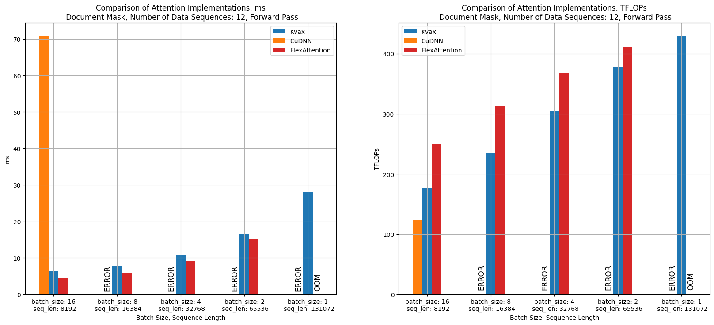
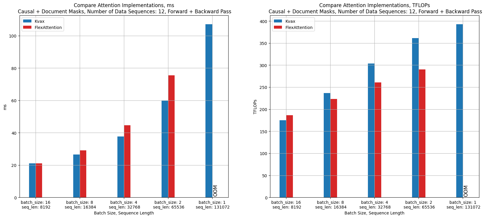

# Kvax: fast and easy-to-use flash attention implementation for JAX

Kvax is an open-source library offering fast and efficient attention operations for the JAX framework. Built with [Flash Attention 2](https://arxiv.org/abs/2307.08691) algorithms implemented in the Triton language, it is optimised for high-performance attention computation with document masks and supports context parallelism. Kvax is designed to perform exceptionally well in distributed training scenarios on long sequences using FSDP/HSDP sharding.

More technical details in our blogpost: https://nebius.com/blog/posts/kvax-open-source-flash-attention-for-jax

#### Table of Contents:
- [Key Concepts of Kvax Implementation](#key-concepts-of-kvax-implementation)
- [Kvax Features](#kvax-features)
- [Kvax Results](#kvax-results)
- [How to install](#how-to-install)
- [How to use](#how-to-use)
  - [Basic Usage](#basic-usage)
  - [Multi-Device Usage with Sharding](#multi-device-usage-with-sharding)
  - [Context Parallelism](#context-parallelism)
  - [Legacy API (Deprecated)](#legacy-api-deprecated)
- [Package Description](#package-description)
- [Benchmarks](#benchmarks)
- [Limitations](#limitations)
- [Contributing](#contributing)
- [Citation](#citation)
- [License](#license)

## Key Concepts of Kvax Implementation

### Document Mask Optimisation

When training transformer models on long sequences, a significant amount of compute is spent on attention operations due to the quadratic complexity of the attention algorithm. [Flash Attention algorithm](https://github.com/Dao-AILab/flash-attention) offers hardware-specific optimisations to significantly reduce latency and memory requirements for these operations.

During training on long sequences, dense packing is often used to maximise compute resource utilisation. In this approach, multiple data points are packed into a single sequence while avoiding cross-sequence attention contamination. The main idea is to calculate only the blocks of attention weights that include tokens which should attend to each other while skipping other blocks. Various methods can efficiently handle this, with [PyTorch's FlexAttention](https://pytorch.org/blog/flexattention/) being one example. Kvax takes a similar approach to achieve high performance in these scenarios.

### Context Parallelism

Using long sequences during training can also lead to high GPU memory consumption for storing layer activations. Context parallelism helps solve this problem, speeding up the computations and reducing memory required for layer activations.

There are several approaches to implementing context parallelism for transformer architectures, such as [RingAttention](https://arxiv.org/abs/2310.01889) and all-gather based method. The all-gather based method, described in the [Llama 3 training paper](https://arxiv.org/abs/2407.21783), performs an all-gather on the key and value tensors, collecting tensors before attention computation due to their lower memory requirements enabled by [GQA](https://arxiv.org/abs/2305.13245). This method is particularly well-suited for document masks, and Kvax leverages it in its implementation.

## Kvax Features

- **Block-wise Attention Masks**: Like [FlexAttention](https://pytorch.org/blog/flexattention/), our implementation builds the attention mask once per forward-backward pass, reusing it across layers. Our high-performance Triton kernel builds this mask blockwise, and does not require `O(seq_len^2)` GPU memory.

- **Optimised Memory Storage**: Kvax stores attention masks in block-wise format, requiring `3 * 4 * batch_size * seq_len // block_size * 4 bytes` (block_size is typically 64 or 128).

- **Skipping Pad Tokens**: Kvax skips blocks consisting entirely of padding tokens. See the "How to Use" section for details on defining padding tokens.

- **Context Parallelism**: Kvax balances tokens across GPUs to ensure equal attention operation loads, accounting for causal masks. This feature is described in [Llama 3 training paper](https://arxiv.org/abs/2407.21783) and fully integrates with document mask optimisations.

## Kvax Results





More details on Kvax benchmarking and its results can be found in the [blogpost](https://nebius.com/blog/posts/kvax-open-source-flash-attention-for-jax#results).

## How to install

Install the latest stable release from pip:

```bash
pip install kvax
```

Or install directly from the wheel:

```bash
pip install https://ueaj.dev/python/kvax-0.1.1-py3-none-any.whl
```

**Note: The automatically installed versions of Triton and JAX-Triton might not be compatible. If you encounter an error while running the provided benchmarks, please ensure that you install compatible versions manually. For benchmarking, we used `triton==3.1` and `jax-triton==0.2.0`.**


## How to use

First, ensure that the position of every padding token is marked with `PADDING_SEGMENT_ID` in the `query_segment_ids` and `kv_segment_ids` tensors:

```python
from kvax.utils import PADDING_SEGMENT_ID

# In this example, the sequence length is 8, and there are 2 padding tokens.
pad_token_id = 128001
input_ids = [6151, 0, 52043, 710, 374, 1618, pad_token_id, pad_token_id]
query_segment_ids = [0, 0, 0, 0, 0, 0, PADDING_SEGMENT_ID, PADDING_SEGMENT_ID]
kv_segment_ids = [0, 0, 0, 0, 0, 0, PADDING_SEGMENT_ID, PADDING_SEGMENT_ID]
```

### Basic Usage

Kvax provides a simple API that doesn't require context managers and can work seamlessly on single or multiple devices:

#### Single Device Usage

```python
from kvax.ops import flash_attention, create_attention_mask
import jax.numpy as jnp

# Create your tensors
batch_size = 2
seq_len = 128
num_heads = 8
head_dim = 64

query = jnp.ones((batch_size, seq_len, num_heads, head_dim))
key = jnp.ones((batch_size, seq_len, num_heads, head_dim))
value = jnp.ones((batch_size, seq_len, num_heads, head_dim))

positions = jnp.arange(seq_len)[None, :].repeat(batch_size, axis=0)
segment_ids = jnp.zeros((batch_size, seq_len), dtype=jnp.int32)

# Create mask - no mesh or specs needed!
mask = create_attention_mask(
    positions, segment_ids, positions, segment_ids
)

# Run attention - no context managers!
output = flash_attention(
    query, key, value,
    positions, segment_ids, positions, segment_ids,
    mask,
    scale=1.0 / jnp.sqrt(head_dim),
)
```

#### Multi-Device Usage with Sharding

```python
from jax.sharding import Mesh
import jax

# Create a mesh
devices = jax.devices()[:2]
mesh = Mesh(devices, axis_names=('data',))

# Define sharding specs - just like shard_map!
query_spec = ('data', None, None, None)  # Shard on batch dimension
kv_spec = ('data', None, None, None)

# Create mask
mask = create_attention_mask(
    positions, segment_ids, positions, segment_ids,
    mesh=mesh,
    query_spec=query_spec,
    kv_spec=kv_spec,
)

# Run attention - clean and simple!
output = flash_attention(
    query, key, value,
    positions, segment_ids, positions, segment_ids,
    mask,
    mesh=mesh,
    query_spec=query_spec,
    kv_spec=kv_spec,
    scale=1.0 / jnp.sqrt(head_dim),
)
```

### Context Parallelism

```python
# Assume we have 4 devices in a 2x2 grid
devices = jax.devices()[:4]
mesh = Mesh(devices.reshape(2, 2), axis_names=('data', 'sequence'))

batch_size = 2
seq_len = 1024  # Will be split across sequence dimension
num_heads = 16
head_dim = 64

# Create inputs
query = jnp.ones((batch_size, seq_len, num_heads, head_dim))
key = jnp.ones((batch_size, seq_len, num_heads, head_dim))
value = jnp.ones((batch_size, seq_len, num_heads, head_dim))

positions = jnp.arange(seq_len)[None, :].repeat(batch_size, axis=0)
segment_ids = jnp.zeros((batch_size, seq_len), dtype=jnp.int32)

# Sharding for context parallelism
query_spec = ('data', 'sequence', None, None)  # Shard on batch AND sequence
kv_spec = ('data', None, None, None)  # KV only sharded on batch

# Create mask
mask = create_attention_mask(
    positions, segment_ids, positions, segment_ids,
    mesh=mesh,
    query_spec=query_spec,
    kv_spec=kv_spec,
)

# Run attention with context parallelism
output = flash_attention(
    query, key, value,
    positions, segment_ids, positions, segment_ids,
    mask,
    mesh=mesh,
    query_spec=query_spec,
    kv_spec=kv_spec,
    scale=1.0 / jnp.sqrt(head_dim),
)
```

### Legacy API (Deprecated)

**Note: This API is deprecated and will show warnings. Use the main API above instead.**

The legacy API uses context managers and requires separate imports:

```python
import flax.linen as nn
from kvax.ops import (
    create_attention_mask,
    flash_attention,
)
from kvax.utils import (
    attention_specs,
    permute_tokens_context_parallelism,
    unpermute_tokens_context_parallelism,
)


class AttentionLayer(nn.Module):
    def  __call__(
        self,
        embedding,
        query_positions,
        query_segment_ids,
        kv_positions,
        kv_segment_ids,
        attn_mask,
    ):
        query, key, value = ...
        scale = ...

        # Call the Flash Attention op
        attn_out = flash_attention(
            query=query,
            key=key,
            value=value,
            query_positions=positions,
            query_segment_ids=segment_ids,
            kv_positions=kv_positions,
            kv_segment_ids=kv_segment_ids,
            mask=attn_mask,
            assume_sequential_positions=self.config.assume_sequential_positions,
            scale=scale,
            # Mesh is defined as a global context
            # mesh=mesh,
        )

        out = ...
        return out


class Transformer(nn.Module):
    ...
    def setup(self):
        self.attn_layers = [AttentionLayer(...) for _ in range(self.num_layers)]
        self.mlp_layers = ...

    def __call__(
        self,
        embedding,
        positions,
        segment_ids,
    ):
        # During inference, create kv_positions and kv_segment_ids from positions and segment_ids
        # For training they could be simply defined as:
        # kv_positions, kv_segment_ids = positions, segment_ids
        kv_positions, kv_segment_ids = self._maybe_cache(positions, segment_ids)

        # Permute input tokens to balance load between GPUs during context_parallelism
        if self._should_permute_input_tokens:
            embeddings, query_positions, query_segment_ids = permute_tokens_context_parallelism(
                (embeddings, positions, segment_ids),
            )

        # Call it once and then pass the mask into all attention blocks
        attention_mask = create_attention_mask(
            query_positions,
            query_segment_ids,
            kv_positions,
            kv_segment_ids,
            fwd_params=self.fa_config.fwd_params,
            bwd_params=self.fa_config.bwd_params,
            skip_pad_tokens=self.fa_config.skip_pad_tokens,
            calc_bwd_mask=True,
            # Mesh is defined as a global context
            # mesh=mesh,
        )

        # Call transformer's layers sequentially
        for attn_layer, mlp_layer in zip(self.attn_layers, self.mlp_layers):
            embedding = attn_layer(
                embedding,
                query_positions,
                query_segment_ids,
                kv_positions,
                kv_segment_ids,
                attention_mask,
            )
            embedding = mlp_layer(...)

        # Unpermute outputs
        if self._should_permute_input_tokens:
            embeddings = unpermute_tokens_context_parallelism(embeddings)

        logits = ...
        return logits


def training_loop(...):
    ...
    # Define mesh as a global context and axes sharding for query, key and value.
    # Can be called inside the Transformer class but before
    # the first call of create_attention_mask, flash_attention,
    # permute_tokens_context_parallelism or unpermute_tokens_context_parallelism.
    mesh = jax.sharding.Mesh(mesh_devices, mesh_names)
    with mesh, attention_specs(
        query_specs=("data", "context", None, None),
        kv_specs=("data", None, None, None),
    ):
        ...
        logits = Transformer(...)(
            embeddings,
            positions,
            segment_ids,
        )

```

## Package Description

### Operations

#### **`flash_attention`**

The main function for attention operations. Import from `kvax.ops`.

**Arguments**:
- `query`: Query tensor of shape `(batch_size, query_seq_length, num_heads, head_dim)`
- `key`: Key tensor of shape `(batch_size, kv_seq_length, num_kv_heads, head_dim)`
- `value`: Value tensor of shape `(batch_size, kv_seq_length, num_kv_heads, head_dim)`
- `query_positions`: Query positions tensor with shape `(batch_size, query_seq_length)`
- `query_segment_ids`: Query segment IDs tensor with shape `(batch_size, query_seq_length)`
- `kv_positions`: Key/value positions tensor with shape `(batch_size, kv_seq_length)`
- `kv_segment_ids`: Key/value segment IDs tensor with shape `(batch_size, kv_seq_length)`
- `mask`: Precomputed attention mask from `create_attention_mask`
- `mesh`: Optional device mesh. If `None`, runs on single device
- `query_spec`: Query sharding spec (e.g., `('data', 'sequence', None, None)`). Required when `mesh` is provided
- `kv_spec`: KV sharding spec (e.g., `('data', None, None, None)`). Required when `mesh` is provided
- `scale`: Scaling factor for attention scores. Default is `1.0`
- Other parameters for performance tuning and debugging

**Returns**: Tensor with attention-weighted values

#### **`create_attention_mask`**

Creates attention masks for flash attention operations. Import from `kvax.ops`.

**Arguments**:
- `query_positions`: Query positions tensor
- `query_segment_ids`: Query segment IDs tensor  
- `kv_positions`: Key/value positions tensor
- `kv_segment_ids`: Key/value segment IDs tensor
- `mesh`: Optional device mesh. If `None`, creates mask for single device
- `query_spec`: Query sharding spec. Required when `mesh` is provided
- `kv_spec`: KV sharding spec. Required when `mesh` is provided
- Other parameters for mask configuration

**Returns**: Attention mask tuple for forward (and optionally backward) passes

#### Legacy API Functions (Deprecated)

##### **`flash_attention`**

The function for attention operation, based on precomputed masks and input tensor sharding specifications. Should be used within the attention_specs context manager.

**Arguments**:

- `query`: Query tensor of shape `(batch_size, query_seq_length, num_heads, head_dim)`.
- `key`: Key tensor of shape `(batch_size, kv_seq_length, num_kv_heads, head_dim)`.
- `value`: Value tensor of shape `(batch_size, kv_seq_length, num_kv_heads, head_dim)`.
- `query_positions`: A tensor of query positions with shape `(batch_size, query_seq_length)`. For sequential tokens, use `range(0, query_seq_length)`. This tensor is ignored if `assume_sequential_positions` is set to `True`.
- `query_segment_ids`: A tensor with segment IDs for the query tokens, shaped `(batch_size, query_seq_length)`. Tokens from the same sequence must share the same segment ID. Segment IDs should be in the range `(0, max(int32))`. All padding tokens should be marked with `PADDING_SEGMENT_ID`.
- `kv_positions`: A tensor of key/value positions with shape `(batch_size, kv_seq_length)`. For sequential tokens, use `range(0, kv_seq_length)`. This tensor is ignored if `assume_sequential_positions` is set to `True`.
- `kv_segment_ids`: A tensor with segment IDs for the key/value tokens, shaped `(batch_size, kv_seq_length)`. Tokens from the same sequence must share the same segment ID. Segment IDs should be in the range `(0, max(int32))`. All padding tokens should be marked with `PADDING_SEGMENT_ID`.
- `mask`: Precomputed block-wise mask from the `create_attention_mask` function.
- `scale`: Scaling factor for attention scores. Default is `1.0`.
- `fwd_params`: `FlashAttentionParamsConfig` for the forward pass. Defaults to predefined parameters for the GPU model.
- `bwd_params`: `FlashAttentionParamsConfig` for the backward pass. Defaults to predefined parameters for the GPU model.
- `assume_sequential_positions`: Assumes sequential token positions and skips loading `query_positions` and `kv_positions`. If set to `True`, the attention behaves the same as when `is_causal == True` in `jax.nn.dot_product_attention`. The default is `False`.
- `memory_optimized_gqa_backward`: Enables memory-optimised gradient computation for grouped-query attention when set to `True`. This flag affects performance, making it slower, but can save GPU memory on activations during the backward pass if it becomes a bottleneck. It may be useful for small models with long contexts. The default is `False`.
- `permute_tokens_for_load_balance`: Permutes tokens to achieve better load balancing across GPUs when set to True. Used only during context parallelism. For more details, refer to the [Llama 3 training paper](https://arxiv.org/abs/2407.21783). The default is True.
- `debug`: Prints the low-level IR of the kernel when set to `True`. The default is `False`.
- `mesh`: Device mesh configuration for distributed execution. If set to `None`, it uses the mesh from the global context. An exception is raised if `None` is provided and no mesh is available from the global context. The default is `None`.

**Returns**:
Tensor with attention-weighted values.

#### **`create_attention_mask`**

This function calculates attention masks for both forward and backward Flash Attention operations, using Triton kernels for block-wise computation.

**Arguments**:

- `query_positions`: A tensor of query positions with shape `(batch_size, query_seq_length)`. For sequential tokens, use `range(0, query_seq_length)`.
- `query_segment_ids`: A tensor with segment IDs for the query tokens, shaped `(batch_size, query_seq_length)`. Tokens from the same sequence must share the same segment ID. Segment IDs should be in the range `(0, max(int32))`. All padding tokens should be marked with `PADDING_SEGMENT_ID`.
- `kv_positions`: A tensor of key/value positions with shape `(batch_size, kv_seq_length)`. For sequential tokens, use `range(0, kv_seq_length)`.
- `kv_segment_ids`: A tensor with segment IDs for the key/value tokens, shaped `(batch_size, kv_seq_length)`. Tokens from the same sequence must share the same segment ID. Segment IDs should be in the range `(0, max(int32))`. All padding tokens should be marked with `PADDING_SEGMENT_ID`.
- `fwd_params`: `FlashAttentionParamsConfig` for the forward pass. Defaults to predefined parameters for the GPU model.
- `bwd_params`: `FlashAttentionParamsConfig` for the backward pass. Defaults to predefined parameters for the GPU model.
- `calc_bwd_mask`: Whether to calculate the attention masks for the backward pass. Default is `False`.
- `skip_pad_tokens`: Whether to skip padding tokens in calculations of attention operation. If `True`, the blocks with padding tokens only will be skipped. Defaults is `True`.
- `mesh`: Device mesh configuration for distributed execution. If set to `None`, it uses the mesh from the global context. An exception is raised if `None` is provided and no mesh is available from the global context. The default is `None`.

**Returns**:
The forward attention mask and optionally attention masks for the backward pass if `calc_bwd_mask` is `True`.

### Utilities

#### **`FlashAttentionParamsConfig`**

Dataclass that contains parameters for the Flash Attention Triton kernel. Increasing `query_block_size` and `kv_block_size` can lead to better performance but requires more streaming multiprocessor register memory on the GPU.

#### **`PADDING_SEGMENT_ID`**

Segment ID for padding tokens. This value should correspond to the position of padding tokens in the `kv_segment_ids` and `query_segment_ids` tensors. See the 'How to use' section for an example.

#### **`attention_specs`** (Deprecated)

**Note: This context manager is deprecated and shows warnings. Use the main API with direct mesh/spec parameters instead.**

A context manager for setting the attention specifications for `query` and `key`/`value` tensors. All other specifications in the Kvax are calculated based on these specifications.

**Arguments**:

- `query_specs`: Specifications for sharding the `query` tensor. Specs must have 4 dimensions and provide sharding dimensions for the following axes: <br> `(batch, query_sequence, heads, attention_head_dim)`
- `kv_specs`: Specifications for sharding the `key`/`value` tensors. Specs must have 4 dimensions and provide sharding dimensions for the following axes: <br> `(batch, kv_sequence, kv_heads, attention_head_dim)`

**Notes**:

- Specs must have the same sharding dimensions for `batch` and `attention_head_dim`.
- Typical values for tensor parallelism with Mesh with axes `"data"` and `"model"`: <br>
`query_specs: ("data", None, "model", None)
kv_specs: ("data", None, "model", None)`
- Typical values for context parallelism with Mesh with axes `"data"` and `"context"`: <br>
`query_specs: ("data", "context", None, None)
kv_specs: ("data", None, None, None)`

#### **`permute_tokens_context_parallelism`** (Legacy API)

A function to permute tokens across the sequence length `(axis==1)` to balance computation of the attention operation between GPUs for the causal mask case. For more details, please see the [Llama 3 training paper](https://arxiv.org/abs/2407.21783). For examples, please refer to the 'How to use' section.

**Note: This function is part of the legacy API. The main API handles token permutation automatically when `permute_tokens_for_load_balance=True` is set in `flash_attention`.**

**Arguments**:

- `inputs`: An input tensor or tuple of tensors to permute.
- `mesh`: Device mesh configuration for distributed execution. If set to `None`, it uses the mesh from the global context. An exception is raised if `None` is provided and no mesh is available from the global context. The default is `None`.

**Returns**:
Permuted tensor or tuple of tensors.

#### **`unpermute_tokens_context_parallelism`** (Legacy API)

A function to unpermute tokens across the sequence length `(axis==1)` after the `permute_tokens_context_parallelism` function to return them to their original order. For examples, please refer to the 'How to use' section.

**Note: This function is part of the legacy API. The main API handles token unpermutation automatically.**

**Arguments**:

- `inputs`: An input tensor or tuple of tensors to unpermute.
- `mesh`: Device mesh configuration for distributed execution. If set to `None`, it uses the mesh from the global context. An exception is raised if `None` is provided and no mesh is available from the global context. The default is `None`.

**Returns**:
A tensor or tuple of tensors with tokens in their original order.

## Benchmarks

**Note**: Before benchmarking, you need to install the required dependencies. First, install the [GPU version of JAX](https://jax.readthedocs.io/en/latest/installation.html). After that, you can install required dependencies:

```bash
pip install -e .[dev]
```

**Note: The automatically installed versions of Triton and JAX-Triton might not be compatible. If you encounter an error while running the provided benchmarks, please ensure that you install compatible versions manually. For benchmarking, we used `triton==3.1` and `jax-triton==0.2.0`.**

Benchmarking CuDNN implementation vs our implementation:

```bash
# Forward with only 1 segment
python3 benchmarks.py mha

# Forward with 3 segments
python3 benchmarks.py mha --num-segments 3

# Forward+backward with 3 segments and 1000 pad tokens
python3 benchmarks.py mha_bwd --num-segments 3 --num-pad-tokens 1000

# Forward with 3 segments and 1000 pad tokens with printing attention mask
python3 benchmarks.py mha --num-segments 3 --num-pad-tokens 1000 --show-attention-mask
```

Benchmarking context vs tensor parallelism on our implementation:

```bash
# Forward with only 1 segment with token permutation enabled
python3 benchmarks.py mha_cp

# Forward+backward with 12 segments with token permutation disabled
python3 benchmarks.py mha_cp_bwd --num-segments 3 --permute-tokens-for-load-balance false

```

## Limitations

- Bias is not supported.
- Sliding window, [ALiBi](https://arxiv.org/abs/2108.12409), and custom masks are not implemented.
- Context parallelism does not support sharding across kv_sequence as in [RingAttention](https://arxiv.org/abs/2310.01889).

## Contributing

Community contributions are welcome. For more detailed information, please refer to the [contributing guidelines](CONTRIBUTING.md).

## Citation

Please cite as:

```
Skvortsov et al., "Kvax: Fast and easy-to-use Flash Attention implementation for JAX", Nebius blog, 2025.
```

BibTeX citation:
```
@article{skvortsov2025kvax,
  title={Kvax: Fast and easy-to-use Flash Attention implementation for JAX},
  author={Skvortsov, Sergei and Fisin, Filipp and Trofimova, Maria and Yangel, Boris},
  year={2025},
  journal={Nebius blog},
  note={}
}
```
## License

This project is licensed under the Apache License, Version 2.0. See the [LICENSE](LICENSE) file for details.

---
© Nebius BV, 2025
